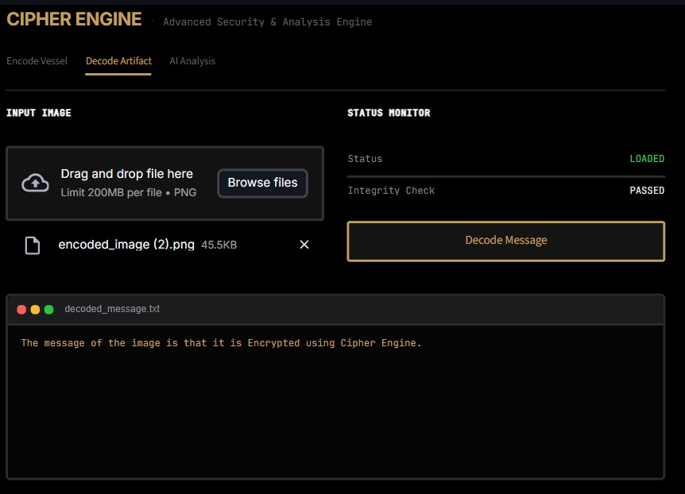

# 🔐 Cipher Engine


> **Advanced Security & Analysis Engine** — LSB steganography platform with RF-based steganalysis, built as a single-file Streamlit application.

---

## 📌 Overview

Cipher Engine is a full-stack steganography tool that lets you **hide secret messages inside images**, **recover them**, and **detect whether any image has been tampered with** — all through a minimal, terminal-styled web interface.

It is powered by NumPy-vectorized LSB (Least Significant Bit) injection, a trained Random Forest classifier for forensic steganalysis, and a custom Streamlit UI with zero external component dependencies.

---

## 🖼️ Project Artifacts

| Encode Vessel | Decode Artifact | AI Analysis |
|:---:|:---:|:---:|
|  |  |  |

---

## 🎯 Feature Breakdown

### 🔒 Tab 1 — Encode Vessel
Embeds a secret UTF-8 message into any PNG or JPG image by overwriting the least significant bit of each pixel channel.

- Computes image capacity in real time (`width × height × 3 channels ÷ 8`)
- Displays live telemetry: dimensions, bit capacity, and `READY` / `OVERFLOW` state
- Appends a `#####` delimiter to mark payload boundaries
- Outputs a lossless `.png` download with the hidden message

### 🔓 Tab 2 — Decode Artifact
Extracts the hidden payload from a previously encoded PNG.

- Reads LSBs across all pixel channels using `numpy.packbits`
- Decodes the raw bit stream to UTF-8 and splits on the delimiter
- Displays result in a styled terminal window
- Returns `"No valid hidden message detected."` if no delimiter is found

### 🤖 Tab 3 — AI Analysis (Steganalysis)
Predicts the probability that an uploaded image contains hidden data using a trained Random Forest classifier.

**Features extracted per image (resized to 128×128):**
| Feature | Description |
|:---|:---|
| Mean Pixel Value | Overall brightness baseline |
| Pixel Variance | Spread of intensity distribution |
| Shannon Entropy | Bit-level randomness (higher = more likely encoded) |
| LSB Variance | Noise level in the least significant bit layer |
| Horizontal Gradient Mean | Edge variation across pixel rows |

**Model Architecture:**
- `RandomForestClassifier` — 50 trees, max depth 5
- Trained on 100 synthetic images (50 clean, 50 LSB-injected)
- Cached via `@st.cache_resource` — trained once per session
- Outputs a `0–100%` manipulation probability score with a `CLEAN` / `DETECTED` verdict

---

## 🗂️ Project Structure

```
Cipher_Engine/
├── app.py               # Full application — UI, encoder, decoder, steganalysis
├── requirements.txt     # Python dependencies
├── Encryption.png       # Screenshot: Encode tab
├── Decryption.png       # Screenshot: Decode tab
└── AI Analysis.png      # Screenshot: AI Analysis tab
```

---

## ⚙️ Tech Stack

| Layer | Technology |
|:---|:---|
| **UI Framework** | Streamlit |
| **Image Processing** | Pillow (PIL), NumPy |
| **ML Classifier** | scikit-learn `RandomForestClassifier` |
| **Styling** | Custom CSS injected via `st.markdown` |
| **Fonts** | Inter, JetBrains Mono (Google Fonts) |
| **Language** | Python 3.8+ |

---

## 🚀 Installation & Setup

### 1. Clone the Repository
```bash
git clone https://github.com/mantraraval/Cipher_Engine.git
cd Cipher_Engine
```

### 2. Create a Virtual Environment

**Windows:**
```bash
python -m venv venv
venv\Scripts\activate
```

**macOS / Linux:**
```bash
python3 -m venv venv
source venv/bin/activate
```

### 3. Install Dependencies
```bash
pip install -r requirements.txt
```

### 4. Run the Application
```bash
streamlit run app.py
```

The app will launch at:
```
http://localhost:8501
```

---

## 📦 Requirements

```
streamlit
pillow
numpy
scikit-learn
```

---

## 🔬 How LSB Steganography Works

Each pixel in an RGB image has three channels (R, G, B), each stored as an 8-bit integer (0–255). Cipher Engine replaces the **least significant bit** of each channel value with one bit of the secret message:

```
Original pixel R channel:  10110110  (182)
Message bit to embed:               1
Modified pixel R channel:  10110111  (183)  ← change of only ±1
```

The visual difference is imperceptible to the human eye, but the message can be fully reconstructed by reading those bits back in order.

**Capacity formula:**
```
Max payload (bytes) = (image width × image height × 3) ÷ 8
```

---

## ⚠️ Limitations

- The steganalysis model is trained on **synthetic data only**. It is a proof-of-concept classifier and should not be treated as a production forensic tool.
- Decoding only works on **PNG files** (lossless). Encoding accepts PNG and JPG, but saving an encoded JPG will destroy the LSB data due to lossy compression — always download the encoded output as PNG.
- No encryption is applied to the message before embedding. The payload is hidden, not secured. For sensitive data, encrypt before encoding.

---

## 📄 License

This project is licensed under the MIT License. See `LICENSE` for details.

---

<div align="center">
  <sub>Built by <a href="https://github.com/mantraraval">mantraraval</a></sub>
</div>
