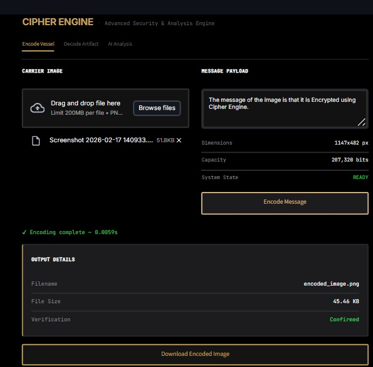

# 🔐 Cipher Engine: AI-Integrated Steganographic Encoding, Decoding & Forensic Analysis

**Cipher Engine** is a high-security **full-stack steganography workflow** that automates the lifecycle of hidden data—from secure payload embedding to machine-learning-based forensic detection.

It combines **NumPy-vectorized image processing** for high-speed encoding, a **Random Forest detection pipeline** for identifying manipulated pixels, and a **Streamlit interface** for real-time interactive inspection.

---

## 🎯 I. Workflow Overview

Cipher Engine follows a structured, four-step pipeline:

1. **User Interaction & Input** → Uploads source imagery and selects the operational mode (Encode/Decode/Detect).
2. **Payload Encoding** → Injecting encrypted binary data into RGB least-significant channels via vectorized masking.
3. **Payload Decoding** → Reconstructing hidden binary streams back into readable UTF-8 messages.
4. **Statistical Detection** → Analyzing pixel-level entropy and gradients to predict the probability of manipulation.

---

## 🛠️ II. Phase-by-Phase Breakdown

### Phase 1: Interactive User Interface
| Component | Role | Tool / Technology |
| :--- | :--- | :--- |
| **Web App** | Provides upload controls and output visualization. | Streamlit |
| **Controller** | Routes requests to specific modules. | Python Logic |

### Phase 2: Payload Encoding Engine
| Component | Role | Tool / Technology |
| :--- | :--- | :--- |
| **Image Loader** | Parses image data into numerical arrays. | Pillow / NumPy |
| **LSB Injector** | Embeds payload bits into RGB channels using masking. | NumPy |

### Phase 3: Payload Decoding Engine
| Component | Role | Tool / Technology |
| :--- | :--- | :--- |
| **LSB Extractor** | Extraction of LSBs from pixel channel matrices. | NumPy |
| **Reconstructor** | Decodes bits into original UTF-8 text. | Python |

### Phase 4: Automated Steganalysis Detection
| Component | Role | Tool / Technology |
| :--- | :--- | :--- |
| **Feature Extractor** | Computes Shannon entropy and pixel gradients. | NumPy |
| **Classifier** | Predicts manipulation via ensemble classification. | Random Forest |

---

## ⚙️ III. Installation & Execution

### 1. Clone Repository
git clone https://github.com/mantraraval/Cipher_Engine.git
cd Cipher_Engine

### 2. Environment Setup

**Windows:**
python -m venv venv
venv\Scripts\activate

**macOS / Linux:**
python3 -m venv venv
source venv/bin/activate

### 3. Initialize Application

**Install Packages:**
pip install -r requirements.txt

**Run Streamlit Application:**
streamlit run app.py

**Access Local Interface:**
http://127.0.0.1:8000  /  http://localhost:8000

---

## 🖼️ IV. Project Artifacts

| Encryption | Decryption | AI Analysis |
|-----------|------------|-------------|
|  |  |  |

---

## 📈 V. Key Outcomes

* **Optimizes data embedding** using high-performance vectorized NumPy operations.
* **Ensures data integrity** by reliably recovering encoded messages from processed images.
* **Automates forensic analysis** via Machine Learning to detect hidden statistical footprints.
* **Simplifies complex cryptography** through an accessible, interactive Streamlit UI.
* 

